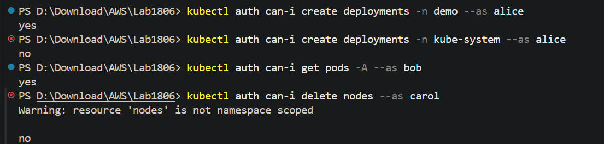
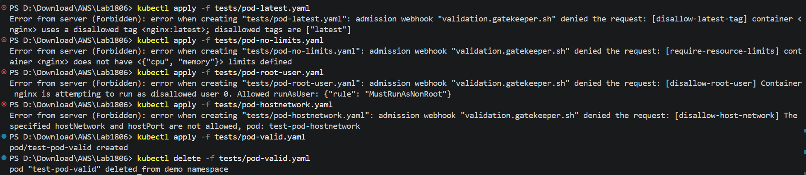
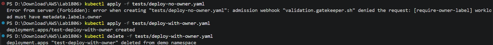
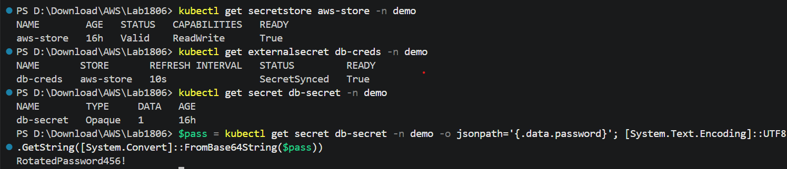
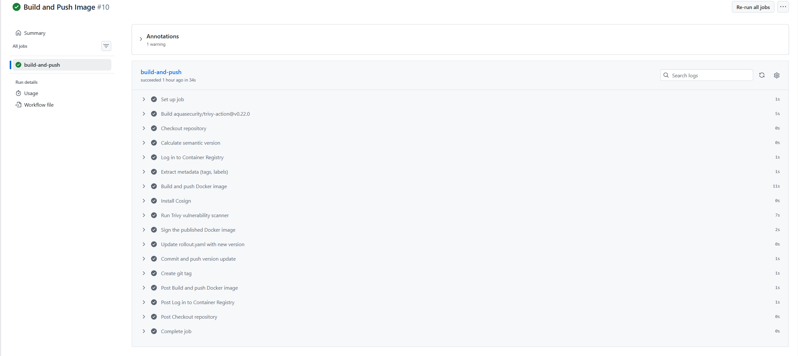

# BÁO CÁO MINH CHỨNG (EVIDENCE) - LAB BUỔI SÁNG

Tài liệu này hướng dẫn chi tiết các bước chạy lệnh kiểm tra và cung cấp sẵn cấu trúc tên file hình ảnh để bạn đặt tên và chèn vào báo cáo nghiệm thu cho 3 phần Lab buổi sáng (RBAC, Gatekeeper, và Custom Policy).

---

## PHẦN 1: LAB 1.1 - THIẾT LẬP RBAC
Chứng minh việc phân quyền thành công cho các tài khoản `alice`, `bob`, và `carol`.

### Lệnh chạy kiểm tra:
Chạy lần lượt 4 lệnh dưới đây trong terminal:
```bash
# 1. Kiểm tra alice có tạo được deployment trong namespace demo (Kỳ vọng: yes)
kubectl auth can-i create deployments -n demo --as alice

# 2. Kiểm tra alice có tạo được deployment trong namespace kube-system (Kỳ vọng: no)
kubectl auth can-i create deployments -n kube-system --as alice

# 3. Kiểm tra bob có đọc được pod ở mọi namespace (Kỳ vọng: yes)
kubectl auth can-i get pods -A --as bob

# 4. Kiểm tra carol có xóa được node không (Kỳ vọng: no)
kubectl auth can-i delete nodes --as carol
```

### Minh chứng cần chụp:
* **Tên file ảnh đặt là:** `1_1_rbac_verify.png`
* **Nội dung cần chụp:** Toàn bộ terminal hiển thị kết quả chạy 4 lệnh trên (kết quả trả về lần lượt là `yes`, `no`, `yes`, `no`).
* **Hiển thị hình ảnh:**
  

---

## PHẦN 2: LAB 1.2 - OPA GATEKEEPER SECURE POLICIES
Chứng minh OPA Gatekeeper đã cấu hình và chặn thành công các tài nguyên vi phạm chính sách an toàn.

### Lệnh chạy kiểm tra:
Chạy lần lượt các lệnh apply file test trong thư mục `tests/`:
```bash
# 1. Test cấm tag :latest (Kỳ vọng: Bị reject)
kubectl apply -f tests/pod-latest.yaml

# 2. Test bắt buộc khai báo resource limits (Kỳ vọng: Bị reject)
kubectl apply -f tests/pod-no-limits.yaml

# 3. Test cấm chạy quyền root (Kỳ vọng: Bị reject)
kubectl apply -f tests/pod-root-user.yaml

# 4. Test cấm sử dụng host network (Kỳ vọng: Bị reject)
kubectl apply -f tests/pod-hostnetwork.yaml

# 5. Test Pod hợp lệ (Kỳ vọng: Tạo thành công)
kubectl apply -f tests/pod-valid.yaml
kubectl delete -f tests/pod-valid.yaml
```

### Minh chứng cần chụp:
* **Tên file ảnh đặt là:** `1_2_gatekeeper.png`
* **Nội dung cần chụp:** Chụp toàn bộ terminal hiển thị kết quả chạy cả 5 lệnh test trên (cho thấy 4 lệnh đầu bị chặn/Forbidden bởi admission webhook, lệnh thứ 5 tạo pod thành công, và lệnh dọn dẹp pod).
* **Hiển thị hình ảnh:**
  

---

## PHẦN 3: LAB 1.3 - CUSTOM CONSTRAINTTEMPLATE (OWNER LABEL)
Chứng minh chính sách tùy chỉnh (Custom Policy) bắt buộc mọi Deployment/Rollout phải có label `owner` hoạt động chính xác.

### Lệnh chạy kiểm tra:
Chạy lần lượt các lệnh test trong terminal:
```bash
# 1. Test deploy Deployment thiếu label owner (Kỳ vọng: Bị reject)
kubectl apply -f tests/deploy-no-owner.yaml

# 2. Test deploy Deployment có label owner (Kỳ vọng: Tạo thành công)
kubectl apply -f tests/deploy-with-owner.yaml

# 3. Dọn dẹp sau khi kiểm tra xong:
kubectl delete -f tests/deploy-with-owner.yaml
```

### Minh chứng cần chụp:
* **Tên file ảnh đặt là:** `1_3_custom_policy.png`
* **Nội dung cần chụp:** Chụp toàn bộ terminal hiển thị kết quả chạy cả 3 lệnh trên (cho thấy lệnh đầu bị chặn/Forbidden, lệnh thứ 2 tạo thành công, và lệnh thứ 3 dọn dẹp deployment).
* **Hiển thị hình ảnh:**
  

---

## PHẦN 4: LAB 2.1 - THIẾT LẬP EXTERNAL SECRETS OPERATOR (ESO)
Chứng minh việc tự động lấy secret từ AWS Secrets Manager thông qua SecretStore và ExternalSecret thành công.

### Lệnh chạy kiểm tra:
Chạy lần lượt các lệnh dưới đây trong terminal:
```bash
# 1. Kiểm tra trạng thái kết nối AWS SecretStore (Kỳ vọng: STATUS = Valid)
kubectl get secretstore aws-store -n demo

# 2. Kiểm tra trạng thái kéo Secret từ AWS Secrets Manager (Kỳ vọng: STATUS = SecretSynced)
kubectl get externalsecret db-creds -n demo

# 3. Kiểm tra Kubernetes Secret tự động được tạo ra (Kỳ vọng: Có secret tên db-secret)
kubectl get secret db-secret -n demo

# 4. Kiểm tra nội dung giải mã của Secret để xác nhận dữ liệu đã được kéo về chính xác
kubectl get secret db-secret -n demo -o jsonpath='{.data.password}' | base64 --decode
```

### Minh chứng cần chụp:
* **Tên file ảnh đặt là:** `2_1_eso_verify.png`
* **Nội dung cần chụp:** Toàn bộ terminal hiển thị kết quả chạy 4 lệnh trên (STATUS hiển thị `Valid` và `SecretSynced`, Kubernetes secret `db-secret` được hiển thị và giá trị mật khẩu giải mã được in ra chính xác).
* **Hiển thị hình ảnh:**
  

---

## PHẦN 5: LAB 2.2 - PHÂN TÍCH LỖ HỔNG VÀ XÁC THỰC CHỮ KÝ (TRIVY + COSIGN + SIGSTORE)
Chứng minh việc kiểm tra lỗ hổng bảo mật (Trivy Scan), ký ảnh container (Cosign Sign) trong CI và chính sách admission controller chặn thành công ảnh không ký.

### Lệnh chạy kiểm tra:
Chạy lần lượt các lệnh dưới đây trong terminal:
```bash
# 1. Kích hoạt xác thực chữ ký ảnh trên namespace demo
kubectl label namespace demo policy.sigstore.dev/include=true --overwrite

# 2. Thử tạo Pod với ảnh chưa được ký (Kỳ vọng: Bị reject bởi webhook policy.sigstore.dev)
kubectl apply -f tests/pod-unsigned.yaml

# 3. Thử tạo Pod với ảnh đã ký hợp lệ (Kỳ vọng: Tạo thành công)
kubectl apply -f tests/pod-signed.yaml

# 4. Dọn dẹp sau khi kiểm tra xong:
kubectl delete -f tests/pod-signed.yaml
```

### Minh chứng cần chụp:
* **Tên file ảnh 1 đặt là:** `2_2_github_actions.png`
* **Nội dung cần chụp:** Chụp màn hình lịch sử chạy GitHub Actions workflow cho thấy build, quét Trivy và ký ảnh Cosign thành công.
* **Hiển thị hình ảnh:**
  

* **Tên file ảnh 2 đặt là:** `2_2_signature_verify.png`
* **Nội dung cần chụp:** Terminal chạy lệnh deploy Pod chưa ký (bị reject với lỗi `validation failed`) và Pod đã ký (tạo thành công).
* **Hiển thị hình ảnh:**
  

---

## PHẦN 6: LAB 2.3 - TRIỂN KHAI LIÊN TỤC (PROGRESSIVE DELIVERY - ARGO ROLLOUTS)
Chứng minh tiến trình triển khai Canary và thu thập metrics đánh giá tự động thành công thông qua Argo Rollouts và Prometheus.

### Lệnh chạy kiểm tra:
Chạy lần lượt các lệnh dưới đây trong terminal:
```bash
# 1. Theo dõi tiến trình Rollout (Kỳ vọng: Đang trong các bước Canary hoặc đã hoàn thành Healthy)
kubectl get rollout api -n demo

# 2. Kiểm tra trạng thái AnalysisRun thu thập metric thành công (Kỳ vọng: STATUS = Running hoặc Successful)
kubectl get analysisrun -n demo
```

### Minh chứng cần chụp:
* **Tên file ảnh 1 đặt là:** `2_3_rollout_progress.png`
* **Nội dung cần chụp:** Terminal hiển thị trạng thái Rollout đang phân chia traffic (Canary) hoặc đã chạy thành công lên 100%, kèm theo danh sách AnalysisRun thành công.
* **Hiển thị hình ảnh:**
  

* **Tên file ảnh 2 đặt là:** `2_3_argocd_healthy.png`
* **Nội dung cần chụp:** Chụp màn hình giao diện Argo CD cho thấy ứng dụng `api` và ứng dụng `analysis` hiển thị màu xanh lá cây (`Healthy`) và đã được đồng bộ hóa (`Synced`).
* **Hiển thị hình ảnh:**
  
