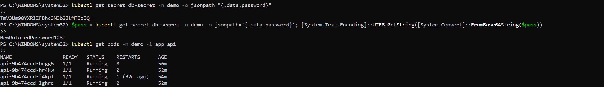
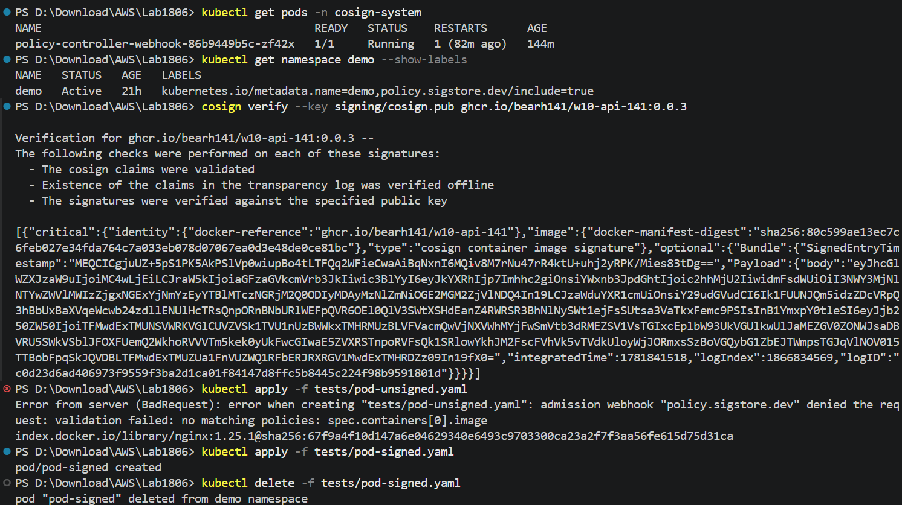

# BÁO CÁO MINH CHỨNG (EVIDENCE) - LAB BUỔI SÁNG

Tài liệu này hướng dẫn chi tiết các bước chạy lệnh kiểm tra và cung cấp sẵn cấu trúc tên file hình ảnh để bạn đặt tên và chèn vào báo cáo nghiệm thu cho 3 phần Lab buổi sáng (RBAC, Gatekeeper, và Custom Policy).

---

## PHẦN 1: LAB 1.1 - THIẾT LẬP RBAC
Chứng minh việc phân quyền thành công cho các tài khoản `alice`, `bob`, và `carol`.

### Lệnh chạy kiểm tra:
Chạy lần lượt 4 lệnh dưới đây trong terminal:
```bash
# 1. Kiểm tra alice có tạo được deployment trong namespace demo (Kỳ vọng: yes)
kubectl auth can-i create deployments -n demo --as alice

# 2. Kiểm tra alice có tạo được deployment trong namespace kube-system (Kỳ vọng: no)
kubectl auth can-i create deployments -n kube-system --as alice

# 3. Kiểm tra bob có đọc được pod ở mọi namespace (Kỳ vọng: yes)
kubectl auth can-i get pods -A --as bob

# 4. Kiểm tra carol có xóa được node không (Kỳ vọng: no)
kubectl auth can-i delete nodes --as carol
```

### Minh chứng cần chụp:
* **Tên file ảnh đặt là:** `1_1_rbac_verify.png`
* **Nội dung cần chụp:** Toàn bộ terminal hiển thị kết quả chạy 4 lệnh trên (kết quả trả về lần lượt là `yes`, `no`, `yes`, `no`).
* **Hiển thị hình ảnh:**
  

---

## PHẦN 2: LAB 1.2 - OPA GATEKEEPER SECURE POLICIES
Chứng minh OPA Gatekeeper đã cấu hình và chặn thành công các tài nguyên vi phạm chính sách an toàn.

### Lệnh chạy kiểm tra:
Chạy lần lượt các lệnh apply file test trong thư mục `tests/`:
```bash
# 1. Test cấm tag :latest (Kỳ vọng: Bị reject)
kubectl apply -f tests/pod-latest.yaml

# 2. Test bắt buộc khai báo resource limits (Kỳ vọng: Bị reject)
kubectl apply -f tests/pod-no-limits.yaml

# 3. Test cấm chạy quyền root (Kỳ vọng: Bị reject)
kubectl apply -f tests/pod-root-user.yaml

# 4. Test cấm sử dụng host network (Kỳ vọng: Bị reject)
kubectl apply -f tests/pod-hostnetwork.yaml

# 5. Test Pod hợp lệ (Kỳ vọng: Tạo thành công)
kubectl apply -f tests/pod-valid.yaml
kubectl delete -f tests/pod-valid.yaml
```

### Minh chứng cần chụp:
* **Tên file ảnh đặt là:** `1_2_gatekeeper.png`
* **Nội dung cần chụp:** Chụp toàn bộ terminal hiển thị kết quả chạy cả 5 lệnh test trên (cho thấy 4 lệnh đầu bị chặn/Forbidden bởi admission webhook, lệnh thứ 5 tạo pod thành công, và lệnh dọn dẹp pod).
* **Hiển thị hình ảnh:**
  

---

## PHẦN 3: LAB 1.3 - CUSTOM CONSTRAINTTEMPLATE (OWNER LABEL)
Chứng minh chính sách tùy chỉnh (Custom Policy) bắt buộc mọi Deployment/Rollout phải có label `owner` hoạt động chính xác.

### Lệnh chạy kiểm tra:
Chạy lần lượt các lệnh test trong terminal:
```bash
# 1. Test deploy Deployment thiếu label owner (Kỳ vọng: Bị reject)
kubectl apply -f tests/deploy-no-owner.yaml

# 2. Test deploy Deployment có label owner (Kỳ vọng: Tạo thành công)
kubectl apply -f tests/deploy-with-owner.yaml

# 3. Dọn dẹp sau khi kiểm tra xong:
kubectl delete -f tests/deploy-with-owner.yaml
```

### Minh chứng cần chụp:
* **Tên file ảnh đặt là:** `1_3_custom_policy.png`
* **Nội dung cần chụp:** Chụp toàn bộ terminal hiển thị kết quả chạy cả 3 lệnh trên (cho thấy lệnh đầu bị chặn/Forbidden, lệnh thứ 2 tạo thành công, và lệnh thứ 3 dọn dẹp deployment).
* **Hiển thị hình ảnh:**
  

---

## PHẦN 4: LAB 2.1 - EXTERNAL SECRETS OPERATOR (ESO) — ROTATE KHÔNG RESTART POD
Chứng minh ESO tự đồng bộ secret từ AWS Secrets Manager, pod không restart khi rotate.

### Lệnh chạy kiểm tra:
Chạy theo đúng thứ tự dưới đây để chứng minh đủ 3 tiêu chí nghiệm thu:

```bash
# BƯỚC 1: Xác nhận ESO đang sync đúng
# 1a. Kiểm tra SecretStore kết nối AWS thành công (Kỳ vọng: STATUS = Valid)
kubectl get secretstore aws-store -n demo

# 1b. Kiểm tra ExternalSecret đang sync (Kỳ vọng: READY = True, STATUS = SecretSynced)
kubectl get externalsecret db-creds -n demo

# 1c. Xác nhận K8s Secret đã được tạo và decode giá trị password hiện tại
# Linux/macOS/Git Bash:
kubectl get secret db-secret -n demo -o jsonpath='{.data.password}' | base64 --decode; echo
# Windows PowerShell:
$pass = kubectl get secret db-secret -n demo -o jsonpath='{.data.password}'; [System.Text.Encoding]::UTF8.GetString([System.Convert]::FromBase64String($pass))

# BƯỚC 2: Ghi lại AGE và RESTARTS của pod TRƯỚC khi rotate
kubectl get pods -n demo -l app=api

# BƯỚC 3: Thực hiện rotate — đổi giá trị trên AWS Secrets Manager
# (Dùng AWS Console hoặc CLI:)
# aws secretsmanager put-secret-value \
#   --secret-id w10/demo/db-password \
#   --secret-string "NewRotatedPassword123!" \
#   --region ap-southeast-1

# BƯỚC 4: Đợi ~15 giây (refreshInterval = 10s), rồi xác nhận Secret đã cập nhật
# Linux/macOS/Git Bash:
kubectl get secret db-secret -n demo -o jsonpath='{.data.password}' | base64 --decode; echo
# Windows PowerShell:
$pass = kubectl get secret db-secret -n demo -o jsonpath='{.data.password}'; [System.Text.Encoding]::UTF8.GetString([System.Convert]::FromBase64String($pass))

# BƯỚC 5: Xác nhận pod KHÔNG restart (AGE và RESTARTS phải giữ nguyên so với Bước 2)
kubectl get pods -n demo -l app=api
```

### Minh chứng cần chụp — 2 ảnh:

* **Tên file ảnh 1:** `2_1_eso_verify.png`
* **Nội dung:** Terminal chạy Bước 1 — hiển thị `SecretStore STATUS=Valid`, `ExternalSecret READY=True / SecretSynced`, và giá trị password giải mã được.
* **Hiển thị hình ảnh:**
  

* **Tên file ảnh 2:** `2_1_eso_rotate_no_restart.png`
* **Nội dung:** Terminal chạy Bước 2 → 5 liên tiếp trong cùng 1 màn hình, chứng minh: password cũ → đổi trên AWS → password mới xuất hiện trong K8s Secret, trong khi cột `AGE` và `RESTARTS` của pod không thay đổi.
* **Hiển thị hình ảnh:**
  

---

## PHẦN 5: LAB 2.2 - TRIVY SCAN + COSIGN SIGN + SIGSTORE ADMISSION VERIFY
Chứng minh: CI đỏ khi có CVE HIGH/CRITICAL, image được ký sau khi scan pass, cluster chặn image không có chữ ký.

### Lệnh chạy kiểm tra:
Chạy theo đúng thứ tự dưới đây:

```bash
# BƯỚC 1: Xác nhận policy-controller webhook đang chạy
kubectl get pods -n cosign-system

# BƯỚC 2: Xác nhận namespace demo có label kích hoạt Sigstore verification
kubectl get namespace demo --show-labels
# Kỳ vọng: có label policy.sigstore.dev/include=true
# Nếu chưa có, chạy:
kubectl label namespace demo policy.sigstore.dev/include=true --overwrite

# BƯỚC 3: Verify chữ ký image đã ký từ CLI (chứng minh image hợp lệ)
cosign verify --key signing/cosign.pub ghcr.io/bearh141/w10-api-141:0.0.2
# Kỳ vọng: in ra JSON xác nhận chữ ký hợp lệ

# BƯỚC 4: Deploy image KHÔNG có chữ ký / không thuộc policy
# (pod-unsigned.yaml dùng docker.io/library/nginx:1.25.1 — không match glob ghcr.io/bearh141/*)
kubectl apply -f tests/pod-unsigned.yaml
# Kỳ vọng: Error từ webhook "policy.sigstore.dev" — no matching policies / validation failed

# BƯỚC 5: Deploy image ĐÃ ký hợp lệ từ CI
kubectl apply -f tests/pod-signed.yaml
# Kỳ vọng: pod/pod-signed created

# Dọn dẹp
kubectl delete -f tests/pod-signed.yaml
```

### Minh chứng cần chụp — 3 ảnh:

* **Tên file ảnh 1:** `2_2_github_actions.png`
* **Nội dung:** Chụp màn hình GitHub Actions workflow run thành công — phải thấy rõ 3 steps: **Trivy scan pass** (xanh), **Cosign sign** (xanh), và tổng workflow **passed**. Nếu có 1 run thất bại vì Trivy phát hiện CVE HIGH thì chụp thêm để minh chứng CI đỏ.
* **Hiển thị hình ảnh:**
  

* **Tên file ảnh 2:** `2_2_cosign.png`
* **Nội dung:** Gộp 2 minh chứng trong 1 ảnh: (1) lệnh `cosign verify` xác nhận chữ ký hợp lệ của image `0.0.3`, và (2) terminal chạy `pod-unsigned` bị reject bởi webhook `policy.sigstore.dev`, còn `pod-signed` được tạo thành công.
* **Hiển thị hình ảnh:**
  
